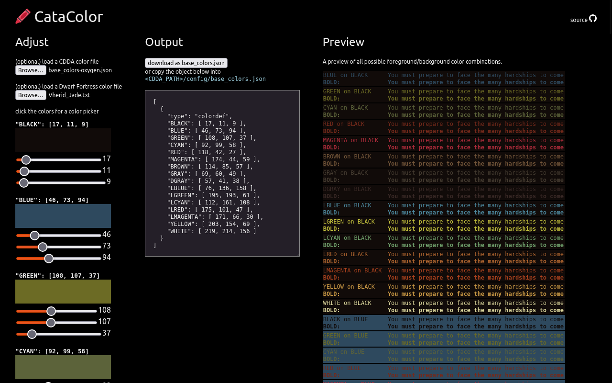

# catacolor

[Use the app](https://catacolor.vercel.app)  

A tool for customizing UI color schemes for [Cataclysm: Dark Days Ahead](https://github.com/CleverRaven/Cataclysm-DDA)  
You can optionally load a Cataclysm json color file or load and convert Dwarf Fortress txt color file as a starting point.  

